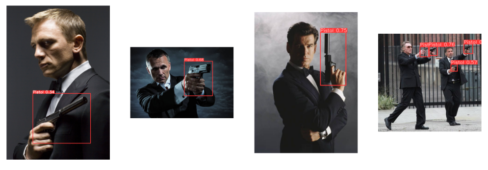

# Pistol Detection

The Pistol Object Detection project is a cutting-edge application of deep learning to improve public safety and security. The system is based on the state-of-the-art You Only Look Once version 8 (YOLOv8) architecture, which is known for its exceptional accuracy and lightning-fast detection speed. With its unique ability to simultaneously predict the class probabilities and bounding boxes of objects in an image, YOLOv8 delivers unparalleled performance for real-time object detection. The system includes a pre-trained model that has been meticulously optimized to detect pistols with high accuracy, and also provides tools and instructions for training the model on new datasets. Whether deployed on a desktop computer, a mobile device, or an embedded system, the Pistol Object Detection system based on YOLOv8 is a powerful and versatile tool that has the potential to revolutionize public safety and security in countless applications.

## Sample Results




## Requirements

The following packages are required to run the notebook:

- ultralytics
- squarify
- pandas
- opencv-python
- matplotlib

You can also install these packages using the following pip command:

```bash
    pip install -r requirements.txt
```

## Usage

Here's how you can use the code in this project:

1. Clone or download the repository to your local machine.
 
2. Download the dataset from Roboflow (link provided below).

3. Open the Jupyter Notebook file in the repository.

4. Run the cells in the notebook to train the model and make predictions.

5. You can modify the code to fit your needs, such as changing the model architecture, training parameters, and prediction logic.

## Dataset

The dataset used in this project is a public dataset of pistol images available on [Roboflow](https://public.roboflow.com/object-detection/pistols). The dataset contains a total of 2,973 images of pistols in various real-world settings, including indoor and outdoor environments. The images are annotated with bounding boxes indicating the location of each pistol in the image.

To prepare the data for use with the Pistol Object Detection system based on YOLOv8, the following pre-processing steps were applied to each image:

* Auto-orientation of pixel data (with EXIF-orientation stripping)
* Resize to 640x640 pixels

In addition, the following augmentation techniques were applied to create 3 versions of each train image:

* Random horizontal flip with a 50% probability
* Random vertical flip with a 50% probability
* Random rotation between -5 and +5 degrees
* Random brightness adjustment of between -10 and +10 percent

The final dataset consists of 3 sets: a training set containing 6,240 images, a validation set containing 594 images, and a test set containing 297 images. The dataset is provided in the YOLOv8 format, which includes the images and corresponding annotation files.

## Model


This Pistol Object Detection system is based on the YOLOv8 architecture and is designed to detect pistols in real-world images and videos with high accuracy and speed. The system uses a pre-trained YOLOv8 model (yolov8x), which has been fine-tuned on a pistol image dataset containing 6,240 images of pistols in various environments. The dataset was pre-processed and augmented to create training, validation, and test sets. The trained model achieved high accuracy and low loss during 20 epochs of training on the dataset. The final model can be used to detect pistols in real-time and is provided in the YOLOv8 format for deployment on different devices and platforms.

## Evaluation

The model was evaluated on a test dataset which was 10% of the original dataset.. The model achieved an mAP50 (mean average precision) score of 87.20%, which indicates that the model can accurately detect pistols with high precision and recall. The model's mAP50-95 score, which measures precision across a range of intersection over union (IoU) thresholds from 50% to 95%, was 63.66%.

To provide a more comprehensive understanding of the model's performance, a confusion matrix was plotted to provide a graphical representation of the number of correct and incorrect predictions made by the model for each class. The confusion matrix allowed us to visualize the model's performance and identify any potential sources of error.

## Future Work

- Training the model with more data or different datasets to improve the accuracy score.
- Training the model for additional epochs.
- Exploring the use of Generative Adversarial Networks to generate new images of chessmen to add to the dataset.

## License

MIT


## Author

[Umar Saeed](https://www.linkedin.com/in/umar-saeed-16863a21b/)
